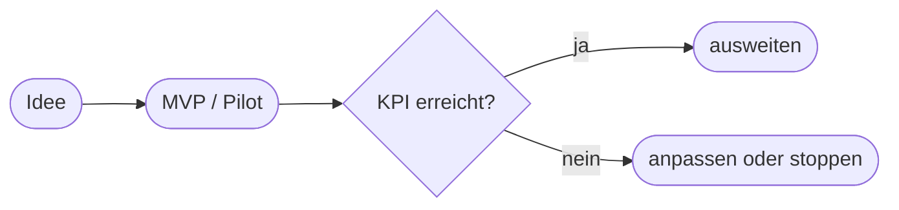

# Kapitel 4 – Entwicklung und Umsetzung von KI-Konzepten

{{ progress(4) }}

<div class="lernziele" markdown>
<h3>Was du in diesem Kapitel lernst</h3>

- Wie aus einer **Idee** ein tragfähiger **KI-Use-Case** wird
- Ein bewährtes **Vorgehensmodell** (CRISP-DM) im Detail
- Wie du Ideen nach **Nutzen** und **Machbarkeit** priorisierst
- Die **Make-or-Buy**-Frage: fertige Werkzeuge (Copilot) vs. Eigenentwicklung
- Warum ein **MVP / Pilot** und klare **KPIs** über Erfolg entscheiden
</div>

---

## 4.1 Von der Idee zum Use Case

Nicht jede Idee ist ein guter KI-Use-Case. Ein tragfähiger Use Case beantwortet vier Kernfragen klar:

| Frage | Worum es geht | Warnsignal |
|---|---|---|
| **Problem** | Welches konkrete Problem lösen wir? | „KI wäre cool" ohne Problem |
| **Daten** | Welche Daten gibt es – in welcher Qualität? | „Daten haben wir schon irgendwo" |
| **Nutzen** | Was ist der messbare Vorteil (Zeit, Geld, Qualität)? | Nutzen nicht bezifferbar |
| **Machbarkeit** | Technisch und organisatorisch umsetzbar? | niemand fühlt sich zuständig |

!!! tip "Der Problem-zuerst-Ansatz"
    Erfolgreiche Vorhaben starten beim **Problem**, nicht bei der Technik. „Wir wollen KI einsetzen" ist kein Ziel. „Wir wollen die Bearbeitungszeit für Angebote um 30 % senken" ist eines – KI ist dann nur eines von mehreren möglichen Mitteln.

---

## 4.2 Ein Vorgehensmodell für KI-Projekte: CRISP-DM

Viele Datenprojekte folgen dem etablierten Modell **CRISP-DM** (*Cross-Industry Standard Process for Data Mining*):


| Phase | Leitfrage | Typische Tätigkeit |
|---|---|---|
| Geschäftsverständnis | Welches Ziel verfolgen wir? | Nutzen und KPI definieren |
| Datenverständnis | Welche Daten haben wir? | Datenquellen sichten, Qualität prüfen |
| Datenaufbereitung | Sind die Daten sauber und nutzbar? | bereinigen, transformieren (Kap. 10) |
| Modellierung | Welches Verfahren/Werkzeug passt? | Modell/Tool wählen und einstellen |
| Evaluation | Erfüllt das Ergebnis die Ziele? | an KPI messen, mit Fachbereich prüfen |
| Einsatz | Wie bringen wir es in den Betrieb? | integrieren, überwachen (Kap. 11) |

!!! info "Iterativ statt linear"
    KI-Projekte laufen selten geradlinig. Häufig muss man zurück – z. B. weil in der Evaluation auffällt, dass die Datenqualität nicht reicht. Diese Schleifen sind **normal**, kein Zeichen von Scheitern.

---

## 4.3 Ideen priorisieren: Nutzen vs. Machbarkeit

Nicht alles gleichzeitig umsetzen. Eine **Nutzen-Machbarkeit-Matrix** schafft Klarheit:

| | Geringer Aufwand | Hoher Aufwand |
|---|---|---|
| **Hoher Nutzen** | ✅ Quick Win – zuerst! | Strategisches Projekt (planen) |
| **Geringer Nutzen** | Nice-to-have (nebenbei) | ❌ vermeiden |

**Quick Wins** sind oft text- und dokumentenlastige Aufgaben, die sich sofort mit **Copilot** angehen lassen – ohne eigene Modelle, ohne Data-Science-Team. Sie schaffen schnelle Erfolge und Akzeptanz (wichtig fürs Change Management, Kap. 37).

---

## 4.4 Make or Buy: fertig nutzen oder selbst bauen?

Eine der wichtigsten Weichenstellungen:

| | Fertige Werkzeuge (z. B. Copilot) | Eigenentwicklung |
|---|---|---|
| Zeit bis Nutzen | sofort | Monate |
| Kosten | Lizenz | Entwicklung + Betrieb |
| Anpassbarkeit | begrenzt | hoch |
| Nötiges Know-how | Bedienung/Prompting | Data Science, Engineering |
| Geeignet für | Standardaufgaben, Text, Office | Spezialfälle, Wettbewerbsvorteil |

!!! tip "Faustregel"
    **Standardaufgaben** (Texte, Zusammenfassungen, Analysen) mit **fertigen Werkzeugen** lösen. Nur wo ein echter **Wettbewerbsvorteil** oder eine sehr spezielle Anforderung besteht, lohnt Eigenentwicklung. Für die meisten Unternehmen ist der Copilot-Weg der schnellste Einstieg.

---

## 4.5 MVP, Pilot und KPIs

Statt „großer Wurf" gilt: klein und messbar starten.

- **MVP (Minimum Viable Product):** die kleinste Version, die einen echten Nutzen zeigt.
- **Pilot:** begrenzter Einsatz mit wenigen Nutzern, um zu lernen.
- **KPI (Kennzahl):** vorab festlegen, woran Erfolg gemessen wird (z. B. „Bearbeitungszeit −30 %").



**Copilot beim Konzipieren nutzen:**

```text
Ich möchte einen KI-Use-Case für [Prozess] konzipieren. Stelle mir strukturiert
die 6 wichtigsten Fragen, die ich vorher klären muss, definiere einen sinnvollen
KPI und nenne ein Risiko, das ich leicht übersehe.
```

!!! tip "Copilot als kritischer Sparringspartner"
    Lass dir Konzepte nicht abnehmen, sondern **hinterfragen**: „Welche Annahmen mache ich?", „Welche Daten brauche ich mindestens?", „Woran würde das Projekt scheitern?". So nutzt du KI als Denkwerkzeug, nicht als Ausrede fürs Nachdenken.

---

## Zusammenfassung

- Guter Use Case = klares **Problem + Daten + messbarer Nutzen + Machbarkeit**.
- **CRISP-DM** strukturiert den Weg – iterativ, mit Rücksprüngen.
- Ideen mit der **Nutzen-Machbarkeit-Matrix** priorisieren; Quick Wins zuerst.
- **Make-or-Buy** bewusst entscheiden – Standard mit Copilot, Spezielles ggf. selbst.
- Klein starten (**MVP/Pilot**) und an vorab definierten **KPIs** messen.

---

## Kurzübungen

{{ task(file="tasks/k04_01.yaml") }}

{{ task(file="tasks/k04_02.yaml") }}

---

## Workshop

{{ task(file="tasks/workshop_k04.yaml") }}
