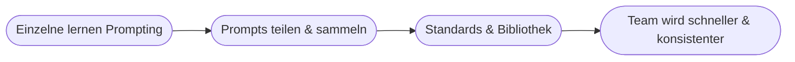

# Kapitel 40 – Prompt Engineering als Schlüsselkompetenz

{{ progress(40) }}

<div class="lernziele" markdown>
<h3>Was du in diesem Kapitel lernst</h3>

- Warum **Prompt Engineering** die zentrale Zukunftskompetenz in der KI-Arbeitswelt ist
- Wie du deine Fähigkeiten vom **Anfänger zum souveränen Anwender** weiterentwickelst
- Wie du eine persönliche und **teamweite Prompt-Praxis** aufbaust
- Wie alle Kursinhalte in einer **verantwortungsvollen Nutzung** zusammenlaufen
- Wie du am Ball bleibst, während sich die Werkzeuge weiterentwickeln
</div>

---

## 40.1 Der rote Faden dieses Kurses

Dieser Kurs begann bei den **Grundlagen der KI** (Block 1), ging über die **Technik** (Block 2), die **Use Cases** (Block 3) und die **Herausforderungen** (Block 4) bis zu den **Erfolgsfaktoren** (Block 5). Eine Fähigkeit zog sich durch alles: **Prompt Engineering** – die Kunst, KI durch Sprache präzise zu steuern.

!!! info "Warum das die Schlüsselkompetenz ist"
    Generative KI wird über **natürliche Sprache** bedient (Kap. 15). Nicht mehr Programmierkenntnisse entscheiden über den Nutzen, sondern die Fähigkeit, **klar zu denken und präzise zu formulieren**. Prompt Engineering ist damit eine Kompetenz, die in **fast jedem Beruf** an Bedeutung gewinnt – so grundlegend wie einst der Umgang mit Office oder Internetrecherche.

---

## 40.2 Die Entwicklungsstufen


| Stufe | Kennzeichen | Beispiel |
|---|---|---|
| **1 – Ausprobieren** | einfache Fragen, Trial & Error | „Schreib mir eine E-Mail" |
| **2 – Struktur nutzen** | Rolle, Kontext, Format bewusst einsetzen (Kap. 14) | vollständiges Prompt-Gerüst |
| **3 – Iterieren & verketten** | nachschärfen, mehrstufig arbeiten | Entwurf → kürzen → Ton anpassen |
| **4 – Systematisieren & teilen** | Prompt-Bibliothek, Standards im Team | wiederverwendbare Vorlagen |

Ziel dieses Kurses ist, dich mindestens auf **Stufe 3** zu bringen – und dir den Weg zu **Stufe 4** zu zeigen.

---

## 40.3 Eine Prompt-Praxis aufbauen

### Persönlich

- **Prompt-Bibliothek** anlegen: bewährte Prompts sammeln (z. B. in OneNote), benennen, verbessern.
- **Muster erkennen:** Welche Formulierungen funktionieren bei dir zuverlässig?
- **Reflektieren:** Bei schlechtem Ergebnis fragen – lag es am Prompt? Wie hätte ich präziser gefragt?

### Im Team

!!! tip "Vom Einzelkönnen zur Team-Fähigkeit"
    Der größte Hebel entsteht, wenn Prompt-Wissen **geteilt** wird: eine gemeinsame Prompt-Bibliothek, regelmäßiger Austausch guter Beispiele, interne **Champions** (Kap. 37) als Ansprechpartner. So wird aus vielen Einzelkönnern eine **organisationale Kompetenz** – genau das, was eine KI-Strategie (Kap. 39) beim Kompetenzaufbau meint.



---

## 40.4 Verantwortung – alles läuft zusammen

Prompt Engineering ist nur die halbe Kompetenz. Die andere Hälfte ist **verantwortungsvolle Nutzung** – die Summe aus Block 4:

| Prinzip | Aus Kapitel |
|---|---|
| Ergebnisse **prüfen** (Halluzinationen) | 15 |
| **Datenschutz** wahren | 33 |
| **rechtliche** Grenzen beachten | 32 |
| **Bias/Fairness** im Blick behalten | 31 |
| **Transparenz** einfordern | 34 |

!!! warning "Der reife Anwender"
    Ein souveräner KI-Anwender ist **nicht** der, der die trickreichsten Prompts kennt – sondern der, der **gute Prompts mit kritischem Urteil** verbindet: schnell zu einem guten Entwurf kommen **und** wissen, was zu prüfen ist, was vertraulich bleibt und wo der Mensch entscheiden muss. Können ohne Verantwortung ist gefährlich; Verantwortung ohne Können ist ineffektiv. Beides zusammen macht dich wertvoll.

---

## 40.5 Am Ball bleiben

Die Werkzeuge entwickeln sich rasant (Kap. 5). Was heute gilt, kann morgen erweitert sein. Beständig bleibt aber das **Prinzip**: klar denken, präzise formulieren, kritisch prüfen.

- **Neugier statt Angst:** Neues ausprobieren, aber besonnen.
- **Prinzipien vor Tricks:** Grundlagen (dieser Kurs) tragen länger als einzelne „Hacks".
- **Lernen als Gewohnheit:** kleine, regelmäßige Experimente statt seltener großer Sprünge.

**Copilot-Prompt zum Abschluss:**

```text
Ich habe eine Weiterbildung zu Prompt Engineering und KI in der Arbeitswelt
abgeschlossen. Erstelle mir einen persönlichen 4-Wochen-Plan, um das Gelernte
im Arbeitsalltag zu festigen – mit je einer konkreten Übung pro Woche und einer
Erinnerung an die wichtigsten Verantwortungs-Regeln.
```

!!! tip "Dein nächster Schritt"
    Wende **ab morgen** eine Sache konkret an: einen echten Arbeitsvorgang mit einem strukturierten Prompt lösen – und das Ergebnis bewusst prüfen. Kompetenz entsteht durch **Anwenden**, nicht durch Zuhören.

---

## Zusammenfassung

- **Prompt Engineering** ist die berufsübergreifende Schlüsselkompetenz der KI-Arbeitswelt.
- Entwicklung in Stufen: **Ausprobieren → Struktur → Iterieren → Systematisieren & Teilen**.
- Baue eine **persönliche und teamweite Prompt-Praxis** auf (Bibliothek, Austausch, Champions).
- Können **plus Verantwortung** (prüfen, Datenschutz, Recht, Fairness, Transparenz) macht den reifen Anwender.
- Bleib am Ball: **Prinzipien vor Tricks**, Neugier statt Angst, Lernen als Gewohnheit.

---

## Kurzübungen

{{ task(file="tasks/k40_01.yaml") }}

{{ task(file="tasks/k40_02.yaml") }}

{{ task(file="tasks/k40_03.yaml") }}

---

## Workshop

{{ task(file="tasks/workshop_k40.yaml") }}
