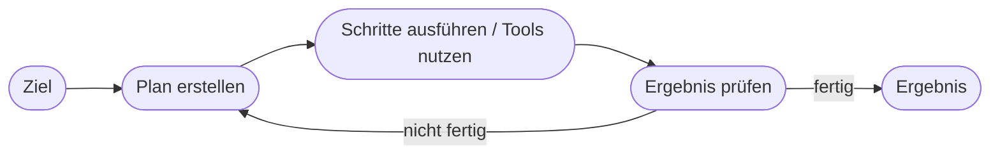
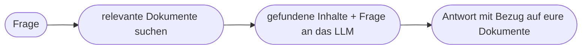

# Kapitel 5 – Aktuelle KI-Trends

{{ progress(5) }}

<div class="lernziele" markdown>
<h3>Was du in diesem Kapitel lernst</h3>

- Die wichtigsten **aktuellen Trends** der KI und was sie praktisch bedeuten
- Was **generative KI**, **KI-Agenten** und **Multimodalität** genau sind – mit Funktionsweise
- Was **RAG** (Retrieval-Augmented Generation) ist und warum es für Unternehmen zentral ist
- Wohin sich Werkzeuge wie **Microsoft Copilot** entwickeln
- Wie du Trends **kritisch einordnest**, statt jedem Hype zu folgen
</div>

---

## 5.1 Generative KI

**Generative KI** erzeugt neue Inhalte – Text, Bilder, Audio, Code – auf Basis von Eingaben. Sie ist der Trend, der KI 2022/2023 in den Alltag gebracht hat.

**Warum das ein Bruch war:** Frühere KI hat vor allem **erkannt und klassifiziert** („ist das Spam?"). Generative KI **erschafft** etwas Neues. Und sie ist über **natürliche Sprache** bedienbar – man braucht keine Programmierkenntnisse mehr. Das öffnet KI für praktisch jeden Beruf.

- Beispiele: Copilot, ChatGPT, Bildgeneratoren
- Für Unternehmen relevant, weil sie **breit einsetzbar** und **niedrigschwellig** ist

---

## 5.2 KI-Agenten

Ein **KI-Agent** löst nicht nur eine einzelne Anfrage, sondern verfolgt ein **Ziel** über mehrere Schritte – er plant, nutzt Werkzeuge und handelt teilweise selbstständig.



**Unterschied zum normalen Chatbot:** Ein Chatbot antwortet auf **eine** Frage. Ein Agent kann eine Aufgabe wie „Recherchiere drei Anbieter, vergleiche Preise und entwirf eine Empfehlung" in **Teilschritte zerlegen**, Werkzeuge (Websuche, Kalender, E-Mail) nutzen und Zwischenergebnisse selbst bewerten.

Microsoft entwickelt Copilot in diese Richtung weiter (**Copilot Agents / Copilot Studio**, Kapitel 30).

!!! warning "Mehr Autonomie = mehr Kontrolle nötig"
    Je selbstständiger ein Agent handelt, desto wichtiger sind **Leitplanken**: Was darf er automatisch tun, wo braucht es eine menschliche Freigabe? Ein Agent, der eigenständig E-Mails verschickt oder Bestellungen auslöst, birgt reale Risiken.

---

## 5.3 Multimodalität

**Multimodale** KI verarbeitet mehrere Datenarten gleichzeitig – Text, Bild, Ton. Du kannst Copilot z. B. ein Foto oder ein Diagramm zeigen und eine Frage dazu stellen.

| Modalität | Beispiel-Aufgabe |
|---|---|
| Text | Zusammenfassen, übersetzen, entwerfen |
| Bild | Diagramm erklären, Foto beschreiben, Skizze deuten |
| Audio | Meeting transkribieren, Sprache verstehen |
| Kombination | Aus Foto einer Fehlermeldung eine Lösung ableiten |

**Praktischer Nutzen:** Ein Mitarbeiter fotografiert eine defekte Maschine samt Typenschild, und Copilot ordnet das Modell zu und schlägt Prüfschritte vor. Früher brauchte das mehrere getrennte Werkzeuge.

---

## 5.4 RAG: KI mit Zugriff auf eigenes Wissen

Ein besonders wichtiger Trend für Unternehmen ist **RAG (Retrieval-Augmented Generation)**. Die Idee: Ein Sprachmodell „weiß" nur, was in seinem Training war – **nicht** eure internen Dokumente. RAG verbindet das Modell mit einer **Wissensquelle**.



!!! info "Warum das so wichtig ist"
    RAG ist der Grund, warum **Microsoft 365 Copilot** auf eure Mails, Dokumente und Teams-Inhalte Bezug nehmen kann: Es sucht passende Inhalte und gibt sie dem Modell als Kontext mit. So werden Antworten **aktuell und unternehmensspezifisch** – statt nur allgemeines Trainingswissen wiederzugeben. RAG reduziert außerdem Halluzinationen, weil die Antwort auf echten Quellen fußt.

---

## 5.5 Weitere Trends im Blick

| Trend | Was dahintersteckt | Praktische Bedeutung |
|---|---|---|
| **Kleine Modelle (SLMs)** | spezialisierte, effiziente Modelle | günstiger, teils lokal auf dem Gerät |
| **On-Device-KI** | KI direkt auf Laptop/Handy | Datenschutz, keine Cloud nötig |
| **KI-Regulierung** | EU AI Act setzt Leitplanken | Pflichten je nach Risiko (Kap. 32) |
| **Individualisierung** | Modelle an Unternehmensdaten anpassen | passgenauere Ergebnisse |

**Copilot-Prompt zum Ausprobieren:**

```text
Nenne die drei wichtigsten KI-Trends für kleine und mittlere Unternehmen in
diesem Jahr. Erkläre je Trend in 2 Sätzen die praktische Bedeutung, nenne ein
konkretes Beispiel und einen möglichen Nachteil.
```

!!! warning "Trend ≠ Pflicht"
    Nicht jeder Trend passt zu jedem Unternehmen. Frage immer: Löst dieser Trend ein **echtes Problem** bei uns? Ein Trend-Radar (siehe Workshop) hilft, zwischen „jetzt relevant" und „nur beobachten" zu unterscheiden.

---

## Zusammenfassung

- **Generative KI** erschafft Inhalte und ist per Sprache bedienbar – der eigentliche Durchbruch.
- **KI-Agenten** verfolgen Ziele über mehrere Schritte – mehr Autonomie erfordert mehr Kontrolle.
- **Multimodalität** verbindet Text, Bild und Ton in einem Werkzeug.
- **RAG** verbindet Sprachmodelle mit eurem eigenen Wissen – Basis von Microsoft 365 Copilot.
- Trends kritisch prüfen: Was löst ein echtes Problem?

---

## Kurzübungen

{{ task(file="tasks/k05_01.yaml") }}

{{ task(file="tasks/k05_02.yaml") }}

{{ task(file="tasks/k05_03.yaml") }}

---

## Workshop

{{ task(file="tasks/workshop_k05.yaml") }}
