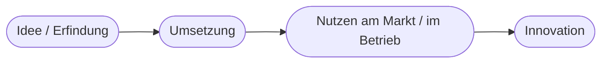
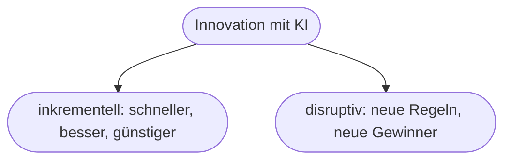
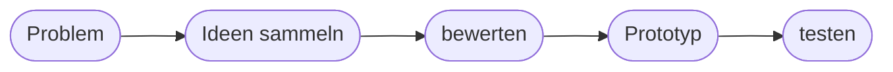

# Kapitel 6 – KI und Innovation

{{ progress(6) }}

<div class="lernziele" markdown>
<h3>Was du in diesem Kapitel lernst</h3>

- Was **Innovation** bedeutet und welche **Arten** es gibt
- Wie KI als **Innovationstreiber** wirkt – auf Produkte, Prozesse und Geschäftsmodelle
- Der Unterschied zwischen **inkrementeller** und **disruptiver** Innovation
- Warum etablierte Unternehmen Innovation oft verschlafen (Innovator's Dilemma)
- Wie du mit **Copilot** systematisch Ideen entwickelst und bewertest
</div>

---

## 6.1 Was ist Innovation?

**Innovation** heißt nicht einfach „neue Idee", sondern eine Idee, die **erfolgreich umgesetzt** wird und einen **realen Nutzen** stiftet.



!!! info "Erfindung ≠ Innovation"
    Eine **Erfindung** ist etwas technisch Neues. Eine **Innovation** entsteht erst, wenn daraus ein **tatsächlicher Mehrwert** wird – am Markt oder im eigenen Betrieb. Viele gute Erfindungen scheitern an der Umsetzung und werden nie zur Innovation.

---

## 6.2 Arten von Innovation

| Art | Was sich ändert | KI-Beispiel |
|---|---|---|
| **Produktinnovation** | neues/besseres Produkt | KI-Funktion in Software (Copilot in Office) |
| **Prozessinnovation** | Abläufe werden besser | automatisierte Dokumentenprüfung |
| **Geschäftsmodellinnovation** | Art des Geldverdienens ändert sich | KI-Service als Abo (Kap. 38) |
| **Serviceinnovation** | neue/bessere Dienstleistung | 24/7-KI-Kundenservice |

KI ist deshalb so wirkmächtig, weil sie **alle vier Arten** gleichzeitig befeuern kann: bessere Produkte, effizientere Prozesse, neue Services – und sogar völlig neue Geschäftsmodelle.

---

## 6.3 Inkrementell vs. disruptiv

| | Inkrementelle Innovation | Disruptive Innovation |
|---|---|---|
| Prinzip | Bestehendes **verbessern** | Bestehendes **verdrängen** |
| Risiko | gering | hoch |
| Beispiel | Copilot beschleunigt bestehende Abläufe | KI verändert ganze Branchen (Übersetzung, Support) |
| Häufigkeit | oft | selten, aber folgenreich |



!!! tip "Für die meisten Unternehmen realistisch"
    Der Alltag von KI ist überwiegend **inkrementell**: bestehende Aufgaben schneller und besser erledigen. Genau hier setzt **Copilot** an. Disruption ist seltener, kann aber ganze Geschäftsmodelle bedrohen – deshalb lohnt der wache Blick nach außen.

---

## 6.4 Warum Etablierte Innovation verschlafen

Erfolgreiche Unternehmen unterschätzen disruptive Neuerungen oft, weil diese anfangs **schlechter oder unrentabler** wirken als das bestehende Geschäft. Man konzentriert sich auf die zahlenden Bestandskunden – bis die neue Technik reif ist und den Markt umkrempelt. Dieses Muster heißt **Innovator's Dilemma**.

!!! example "KI als aktuelles Beispiel"
    Frühe KI-Textwerkzeuge wirkten „nett, aber unzuverlässig". Wer sie deshalb ignorierte, steht heute unter Druck, weil Wettbewerber ihre Prozesse längst beschleunigt haben. Die Lehre: Neuerungen **früh und im Kleinen ausprobieren**, statt zu warten, bis sie „perfekt" sind.

---

## 6.5 KI als Werkzeug im Innovationsprozess

KI hilft nicht nur *als* Innovation – sie unterstützt auch *beim Innovieren*: als Ideengeber, Sparringspartner und schneller Prototyp-Helfer.



**Copilot in jeder Phase:**

| Phase | Copilot-Einsatz |
|---|---|
| Ideen sammeln | viele Ansätze generieren, Perspektiven wechseln |
| Bewerten | Ideen nach Kriterien vergleichen, Risiken benennen |
| Prototyp | Textentwürfe, Konzepte, Beispiel-Inhalte erstellen |
| Testen | Feedback strukturieren, Argumente prüfen |

**Copilot-Prompt zum Ausprobieren:**

```text
Ich suche neue Ideen, wie unser [Bereich] durch KI besser werden kann.
Generiere 10 Ideen, ordne sie nach Aufwand (niedrig/mittel/hoch) und Nutzen,
und markiere die 3 vielversprechendsten Quick Wins.
```

!!! tip "Menge zuerst, dann Auswahl"
    KI ist stark darin, **viele** Ideen schnell zu liefern (Divergenz). Die **Auswahl und Bewertung** (Konvergenz) bleibt deine Aufgabe – idealerweise mit den Kriterien Nutzen und Machbarkeit aus Kapitel 4.

---

## Zusammenfassung

- Innovation = Idee **+ Umsetzung + realer Nutzen** (nicht nur Erfindung).
- Es gibt Produkt-, Prozess-, Geschäftsmodell- und Serviceinnovation – KI wirkt auf alle.
- KI-Innovation ist meist **inkrementell** (Copilot-Alltag), selten **disruptiv** (branchenverändernd).
- Das **Innovator's Dilemma** erklärt, warum man Neues früh ausprobieren sollte.
- Copilot unterstützt den ganzen Innovationsprozess – die **Bewertung** bleibt beim Menschen.

---

## Kurzübungen

{{ task(file="tasks/k06_01.yaml") }}

{{ task(file="tasks/k06_02.yaml") }}

{{ task(file="tasks/k06_03.yaml") }}

---

## Workshop

{{ task(file="tasks/workshop_k06.yaml") }}
