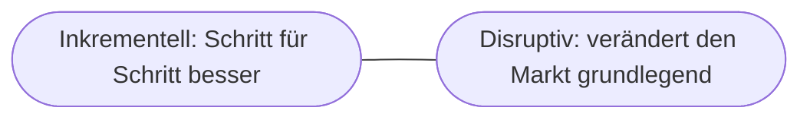

# Kapitel 6 – KI und Innovation

{{ progress(6) }}

<div class="lernziele" markdown>
<h3>Was du in diesem Kapitel lernst</h3>

- Was **Innovation** bedeutet und welche **Arten** es gibt
- Wie KI als **Innovationstreiber** wirkt – bei Produkten, Prozessen und Geschäftsmodellen
- Der Unterschied zwischen **inkrementeller** und **disruptiver** Innovation
- Wie du mit **Copilot** systematisch Innovationsideen entwickelst
</div>

---

## 6.1 Was ist Innovation?

**Innovation** ist mehr als eine gute Idee: Es ist die **erfolgreiche Umsetzung** einer Neuerung, die einen **Mehrwert** schafft. Man unterscheidet, *was* neu ist:

| Art | Was ist neu? | Beispiel mit KI |
|---|---|---|
| Produktinnovation | Ein neues/verbessertes Angebot | KI-gestützte Übersetzungs-App |
| Prozessinnovation | Eine bessere Art zu arbeiten | Automatisierte Rechnungsprüfung |
| Geschäftsmodell-Innovation | Eine neue Art, Wert zu schaffen/verdienen | Datenbasierter Service statt Produktverkauf |

---

## 6.2 Inkrementell vs. disruptiv



| Merkmal | Inkrementell | Disruptiv |
|---|---|---|
| Veränderung | klein, kontinuierlich | grundlegend |
| Risiko | gering | hoch |
| Beispiel | schnellerer Kundenservice durch Chatbot | KI-Assistent ersetzt ganze Arbeitsweise |

!!! info "Beides ist wertvoll"
    Unternehmen brauchen beides: viele kleine Verbesserungen **und** den Mut zu größeren Sprüngen. KI ermöglicht aktuell beides gleichzeitig.

---

## 6.3 KI als Innovationstreiber

KI beschleunigt Innovation auf mehreren Ebenen:

- **Ideenfindung:** KI liefert schnell viele Varianten (Brainstorming-Partner)
- **Prototyping:** Entwürfe für Texte, Bilder, Code entstehen in Minuten
- **Wissen:** Große Informationsmengen werden schnell nutzbar
- **Personalisierung:** Angebote lassen sich individuell zuschneiden

---

## 6.4 Innovation mit Copilot entwickeln

Copilot ist ein starker **Ideengeber** – gerade in frühen Phasen.

**Copilot-Prompt zum Ausprobieren:**

```text
Ich arbeite in [Branche/Bereich]. Schlage 10 Innovationsideen vor, wie wir KI
einsetzen könnten. Sortiere sie in "inkrementell" und "disruptiv" und markiere
die 3 vielversprechendsten mit kurzer Begründung.
```

!!! tip "Divergent, dann konvergent"
    Nutze KI erst zum **Sammeln** möglichst vieler Ideen (divergent), dann zum **Bewerten und Zuspitzen** (konvergent). Die Auswahl und Verantwortung bleiben bei dir.

---

## Kurzübungen

{{ task(file="tasks/k06_01.yaml") }}

{{ task(file="tasks/k06_02.yaml") }}

---

## Workshop

{{ task(file="tasks/workshop_k06.yaml") }}
