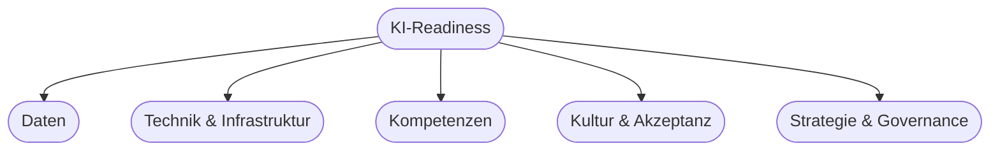

# Kapitel 7 – KI-Readiness

{{ progress(7) }}

<div class="lernziele" markdown>
<h3>Was du in diesem Kapitel lernst</h3>

- Was **KI-Readiness** bedeutet und warum sie über Erfolg oder Scheitern entscheidet
- Die zentralen **Handlungsfelder**: Daten, Technik, Kompetenzen, Kultur, Strategie
- Wie du den **Reifegrad** eines Unternehmens einschätzt
- Wie **Copilot** einen niedrigschwelligen Einstieg ermöglicht
</div>

---

## 7.1 Was ist KI-Readiness?

**KI-Readiness** beschreibt, wie gut ein Unternehmen darauf vorbereitet ist, KI **erfolgreich** einzusetzen. Sie ist nicht nur eine technische Frage – oft scheitern KI-Vorhaben an Daten, Kompetenzen oder Kultur, nicht am Algorithmus.

---

## 7.2 Die Handlungsfelder der KI-Readiness



| Handlungsfeld | Leitfrage |
|---|---|
| Daten | Sind Daten vorhanden, zugänglich und von ausreichender Qualität? |
| Technik & Infrastruktur | Gibt es passende Werkzeuge, Cloud, Schnittstellen? |
| Kompetenzen | Können Mitarbeitende KI-Werkzeuge nutzen (z. B. Prompting)? |
| Kultur & Akzeptanz | Ist die Belegschaft offen für Veränderung? |
| Strategie & Governance | Gibt es Ziele, Regeln und Verantwortliche? |

---

## 7.3 Reifegradmodell

Ein einfaches Modell hilft bei der Standortbestimmung:

| Stufe | Beschreibung |
|---|---|
| 1 – Neugierig | Erste Experimente, kein Plan |
| 2 – Aktiv | Einzelne Use Cases, Copilot im Einsatz |
| 3 – Systematisch | KI-Strategie, mehrere Projekte, Regeln |
| 4 – Integriert | KI ist fester Teil von Prozessen und Kultur |

!!! tip "Copilot als Einstiegspunkt"
    Werkzeuge wie **Microsoft Copilot** erlauben schon auf **Stufe 1–2** echten Mehrwert – ohne eigene Modelle oder Data-Science-Team. Das senkt die Einstiegshürde erheblich.

---

## 7.4 Readiness einschätzen mit Copilot

**Copilot-Prompt zum Ausprobieren:**

```text
Erstelle eine Checkliste mit 10 Fragen, mit der ich die KI-Readiness eines
mittelständischen Unternehmens einschätzen kann. Gruppiere die Fragen nach
Daten, Technik, Kompetenzen, Kultur und Strategie.
```

!!! warning "Ehrlich bewerten"
    Eine geschönte Selbsteinschätzung nützt nichts. Der Wert liegt darin, **Lücken sichtbar** zu machen und gezielt anzugehen.

---

## Kurzübungen

{{ task(file="tasks/k07_01.yaml") }}

{{ task(file="tasks/k07_02.yaml") }}

---

## Workshop

{{ task(file="tasks/workshop_k07.yaml") }}
