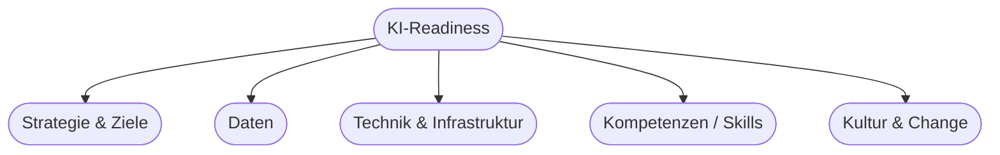

# Kapitel 7 – KI-Readiness

{{ progress(7) }}

<div class="lernziele" markdown>
<h3>Was du in diesem Kapitel lernst</h3>

- Was **KI-Readiness** bedeutet und warum sie über Erfolg oder Scheitern entscheidet
- Die **fünf Dimensionen** der Reife: Strategie, Daten, Technik, Kompetenzen, Kultur
- Wie du den **Reifegrad** eines Unternehmens einschätzt
- Warum **Copilot** eine besonders niedrige Einstiegshürde hat
- Wie du eine ehrliche **Standortbestimmung** durchführst
</div>

---

## 7.1 Was ist KI-Readiness?

**KI-Readiness** beschreibt, wie gut ein Unternehmen darauf **vorbereitet** ist, KI erfolgreich einzusetzen. Viele KI-Projekte scheitern nicht an der Technik, sondern an fehlenden Voraussetzungen: schlechte Daten, unklare Ziele, fehlendes Know-how oder Widerstand in der Belegschaft.

!!! info "Die unbequeme Wahrheit"
    Studien zeigen seit Jahren dasselbe Muster: Ein großer Teil der KI-Projekte kommt nie über den Pilotstatus hinaus. Der häufigste Grund ist **nicht** die Technik, sondern mangelnde organisatorische Reife – vor allem bei **Daten** und **Menschen**.

---

## 7.2 Die fünf Dimensionen der KI-Readiness



| Dimension | Leitfrage | Typische Lücke |
|---|---|---|
| **Strategie** | Wissen wir, *wozu* wir KI wollen? | KI als Selbstzweck ohne Ziel |
| **Daten** | Haben wir nutzbare, saubere Daten? | Daten verstreut, schlechte Qualität |
| **Technik** | Ist die IT-Infrastruktur bereit? | Altsysteme, keine Schnittstellen |
| **Kompetenzen** | Können die Menschen mit KI umgehen? | fehlendes Prompting-/Datenwissen |
| **Kultur** | Ist die Belegschaft offen? | Angst, Widerstand, „haben wir immer so gemacht" |

!!! tip "Die schwächste Dimension entscheidet"
    KI-Readiness ist wie eine Kette: Die **schwächste** Dimension bestimmt das Ergebnis. Perfekte Daten nützen nichts, wenn niemand die Werkzeuge bedienen kann – und beste Werkzeuge nützen nichts ohne Akzeptanz (Kap. 37).

---

## 7.3 Reifegrade einschätzen

Ein einfaches Stufenmodell hilft bei der Standortbestimmung:

| Stufe | Beschreibung |
|---|---|
| 1 – **Anfang** | Kein klarer KI-Einsatz, vereinzelte Experimente |
| 2 – **Erprobung** | Erste Piloten, Copilot wird ausprobiert |
| 3 – **Etabliert** | KI in einzelnen Prozessen fest verankert |
| 4 – **Skaliert** | KI bereichsübergreifend, Prozesse angepasst |
| 5 – **Transformiert** | KI ist Teil der Geschäftsstrategie und -kultur |

Die meisten Unternehmen stehen auf **Stufe 1–2**. Werkzeuge wie Copilot helfen, schnell auf Stufe 2–3 zu kommen, weil sie **keine eigene Infrastruktur** erfordern.

---

## 7.4 Warum Copilot der einfachste Einstieg ist

Klassische KI-Projekte brauchen Daten, Modelle, Server und Fachleute. **Microsoft Copilot** senkt die Einstiegshürde drastisch:

| Anforderung | Klassisches KI-Projekt | Copilot |
|---|---|---|
| Eigene Daten aufbereiten | ja, aufwendig | nein (nutzt vorhandene M365-Daten) |
| Modelle trainieren | ja | nein (fertig) |
| Infrastruktur | Server/Cloud | vorhanden (M365) |
| Spezial-Know-how | Data Science | **Prompting** genügt |
| Zeit bis Nutzen | Monate | sofort |

!!! example "Realistischer Startpunkt"
    Ein Unternehmen mit Microsoft 365 kann in **Tagen** produktiv mit Copilot arbeiten – ohne ein einziges Modell zu trainieren. Genau deshalb ist die zentrale Readiness-Frage für viele nicht „Haben wir Data Scientists?", sondern „Können unsere Leute gut **prompten** und gehen sie **verantwortungsvoll** mit Ergebnissen um?"

---

## 7.5 Standortbestimmung durchführen

**Copilot-Prompt zum Ausprobieren:**

```text
Erstelle einen Selbsttest mit 10 Fragen, mit dem ein mittelständisches
Unternehmen seine KI-Readiness in den Dimensionen Strategie, Daten, Technik,
Kompetenzen und Kultur einschätzen kann. Nutze eine Skala von 1–5 und gib
je Ergebnisbereich eine kurze Handlungsempfehlung.
```

!!! tip "Ehrlichkeit vor Schönfärberei"
    Eine Standortbestimmung nützt nur, wenn sie **ehrlich** ist. Es geht nicht darum, gut dazustehen, sondern die **echten Lücken** zu finden – denn genau die entscheiden über den späteren Erfolg. Bewertet man sich zu gut, plant man Projekte, für die die Basis fehlt.

---

## Zusammenfassung

- **KI-Readiness** = Vorbereitung entlang von fünf Dimensionen: Strategie, Daten, Technik, Kompetenzen, Kultur.
- Die **schwächste** Dimension begrenzt den Erfolg – oft sind es Daten oder Menschen, nicht die Technik.
- Ein **Reifegradmodell** hilft, den Standort zu bestimmen; die meisten stehen auf Stufe 1–2.
- **Copilot** senkt die Einstiegshürde enorm – Prompting-Kompetenz wird wichtiger als Data-Science-Know-how.

---

## Kurzübungen

{{ task(file="tasks/k07_01.yaml") }}

{{ task(file="tasks/k07_02.yaml") }}

---

## Workshop

{{ task(file="tasks/workshop_k07.yaml") }}
