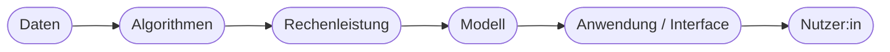
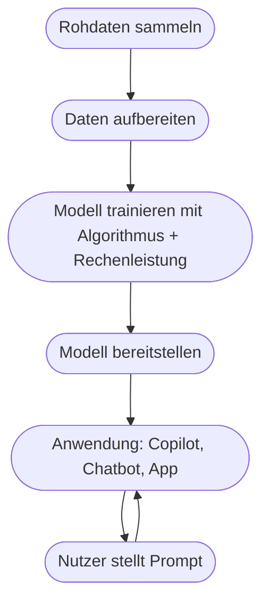

# Kapitel 8 – Das KI-Periodensystem

{{ progress(8) }}

<div class="lernziele" markdown>
<h3>Was du in diesem Kapitel lernst</h3>

- Was mit dem **„KI-Periodensystem"** gemeint ist und warum die Idee hilfreich ist
- Die zentralen **Bausteine** eines KI-Systems: Daten, Algorithmen, Rechenleistung, Modelle, Anwendungen
- Wie diese Bausteine **zusammenspielen** – von den Rohdaten bis zur Anwendung
- Wo **Microsoft Copilot** in diesem Baukasten sitzt
- Warum du nicht jeden Baustein selbst bauen musst
</div>

---

## 8.1 Die Idee eines „KI-Periodensystems"

So wie das chemische Periodensystem alle **Grundelemente** ordnet, aus denen Stoffe bestehen, lässt sich auch KI in wiederkehrende **Grundbausteine** zerlegen. Fast jedes KI-System – ob Spam-Filter oder Copilot – kombiniert dieselben Elemente in unterschiedlicher Ausprägung.

!!! info "Warum dieses Bild hilft"
    Der Begriff ist kein offizieller Standard, sondern ein **Denkmodell**. Es hilft, jede KI-Lösung zu „sezieren": Welche Daten? Welcher Algorithmus? Welches Modell? Welche Anwendung? Wer die Bausteine kennt, versteht neue KI-Produkte schneller und kann ihre Grenzen besser einschätzen.

---

## 8.2 Die zentralen Bausteine



| Baustein | Rolle | Analogie |
|---|---|---|
| **Daten** | Rohstoff, aus dem gelernt wird | Zutaten |
| **Algorithmen** | Lernverfahren, das Muster findet | Rezept |
| **Rechenleistung** | Kraft, um zu trainieren | Herd/Ofen |
| **Modell** | das „gelernte Wissen" | fertiges Gericht |
| **Anwendung** | Zugang für Menschen | Teller/Serviervorschlag |

### Baustein 1: Daten

Ohne Daten keine KI. Die **Qualität** der Daten bestimmt die Qualität des Ergebnisses – daher der Grundsatz **„Garbage in, garbage out"**. Datenbeschaffung und -aufbereitung behandeln die Kapitel 9 und 10.

### Baustein 2: Algorithmen

Der Algorithmus ist das **Lernverfahren** – die Vorschrift, *wie* aus Daten Muster werden (z. B. neuronale Netze, Entscheidungsbäume). Details in Kapitel 12.

### Baustein 3: Rechenleistung

Große Modelle brauchen enorme Rechenleistung, meist spezielle **Grafikprozessoren (GPUs)** in Rechenzentren. Für dich als Copilot-Nutzer:in läuft das unsichtbar in der **Microsoft-Cloud**.

### Baustein 4: Modell

Das **Modell** ist das Ergebnis des Trainings – das „geronnene Wissen". Ein Sprachmodell wie das hinter Copilot hat aus riesigen Textmengen gelernt (Kapitel 15/16).

### Baustein 5: Anwendung

Die **Anwendung** macht das Modell nutzbar – über eine Oberfläche, mit der Menschen ohne Fachwissen arbeiten. **Copilot** ist genau das: eine Anwendung, die ein mächtiges Modell hinter einer einfachen Chat-Oberfläche zugänglich macht.

---

## 8.3 Wie die Bausteine zusammenspielen



Zwei Phasen sind wichtig zu unterscheiden:

- **Training** (einmalig/aufwendig): aus Daten wird ein Modell. Braucht viel Rechenleistung.
- **Nutzung / Inferenz** (laufend): das fertige Modell beantwortet Anfragen. Das passiert jedes Mal, wenn du Copilot einen Prompt gibst.

---

## 8.4 Wo Copilot sitzt – und was das bedeutet

**Microsoft Copilot** bündelt fast alle Bausteine als fertigen Service:

| Baustein | Bei Copilot |
|---|---|
| Daten | Trainingsdaten (Microsoft/OpenAI) + deine M365-Daten via RAG |
| Algorithmen | vortrainierte Transformer-Modelle |
| Rechenleistung | Microsoft-Cloud (Azure) |
| Modell | GPT-basierte Sprachmodelle |
| Anwendung | Copilot in Word, Excel, Teams … |

!!! tip "Die entscheidende Erkenntnis"
    Du musst die unteren Bausteine (Daten-Training, Algorithmen, Rechenleistung) **nicht selbst bauen**. Deine Aufgabe liegt auf der **Anwendungsebene**: gute Prompts formulieren, Ergebnisse prüfen, sinnvoll einsetzen. Das ist der große Vorteil fertiger Werkzeuge – und der Grund, warum sich dieser Kurs auf **Prompt Engineering** konzentriert.

**Copilot-Prompt zum Ausprobieren:**

```text
Zerlege ein KI-System deiner Wahl (z. B. einen Spam-Filter) in die Bausteine
Daten, Algorithmus, Modell und Anwendung. Erkläre je Baustein in einem Satz,
was er konkret leistet.
```

---

## Zusammenfassung

- Jedes KI-System lässt sich in **Grundbausteine** zerlegen: Daten, Algorithmen, Rechenleistung, Modell, Anwendung.
- **Daten** sind der Rohstoff, das **Modell** das gelernte Ergebnis, die **Anwendung** der Zugang für Menschen.
- Unterscheide **Training** (Modell entsteht) und **Nutzung/Inferenz** (Modell antwortet).
- **Copilot** liefert alle unteren Bausteine fertig – dein Hebel liegt auf der **Anwendungsebene**.

---

## Kurzübungen

{{ task(file="tasks/k08_01.yaml") }}

{{ task(file="tasks/k08_02.yaml") }}

{{ task(file="tasks/k08_03.yaml") }}

---

## Workshop

{{ task(file="tasks/workshop_k08.yaml") }}
