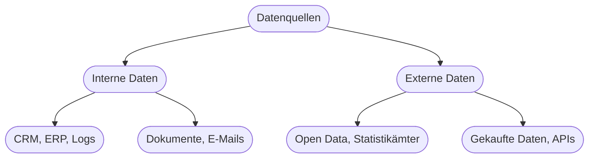

# Kapitel 9 – Datenbeschaffung

{{ progress(9) }}

<div class="lernziele" markdown>
<h3>Was du in diesem Kapitel lernst</h3>

- Warum Daten der **Rohstoff** jeder KI sind
- Welche **Datenquellen** es gibt und wie du sie erschließt
- Was **Datenqualität** ausmacht (die „5 V" und Gütekriterien)
- Welche **rechtlichen** Punkte du bei der Beschaffung beachten musst
</div>

---

## 9.1 Daten als Rohstoff der KI

KI lernt aus Daten. Ohne passende Daten gibt es keine gute KI – *„garbage in, garbage out"*. Die Datenbeschaffung ist deshalb oft der **aufwendigste** Teil eines KI-Projekts.

---

## 9.2 Datenquellen



| Quelle | Beispiel | Hinweis |
|---|---|---|
| Interne Systeme | CRM, ERP, Warenwirtschaft | oft ungenutzter Schatz |
| Dokumente | Verträge, Berichte, E-Mails | unstrukturiert, aber wertvoll |
| Öffentliche Daten | Statistikämter, Open Data | kostenlos, gut zum Anreichern |
| APIs / Dienste | Wetter, Geodaten | aktuell, oft kostenpflichtig |
| Sensoren (IoT) | Maschinendaten | Basis für Predictive Maintenance |

---

## 9.3 Datenqualität: die „V" und Gütekriterien

**Gütekriterien** guter Daten:

| Kriterium | Frage |
|---|---|
| Vollständigkeit | Fehlen Werte? |
| Korrektheit | Sind die Werte richtig? |
| Aktualität | Sind die Daten aktuell genug? |
| Konsistenz | Widersprechen sich Daten? |
| Relevanz | Passen die Daten zum Ziel? |

!!! warning "Menge ist nicht Qualität"
    Viele Daten (Volume) helfen nur, wenn sie **korrekt, relevant und aktuell** sind. Schlechte Daten führen zu schlechten KI-Ergebnissen – egal wie modern das Modell ist.

---

## 9.4 Rechtliche Leitplanken

- **Personenbezogene Daten** unterliegen der **DSGVO** (siehe Kapitel 33).
- **Urheber-/Nutzungsrechte** bei externen Daten prüfen.
- **Zweckbindung:** Daten nur für den vereinbarten Zweck nutzen.

**Copilot-Prompt zum Ausprobieren:**

```text
Ich möchte für den Use Case "[Use Case]" Daten beschaffen. Erstelle eine
Checkliste: mögliche interne und externe Datenquellen, Qualitätskriterien und
rechtliche Punkte, die ich prüfen muss.
```

---

## Kurzübungen

{{ task(file="tasks/k09_01.yaml") }}

{{ task(file="tasks/k09_02.yaml") }}

---

## Workshop

{{ task(file="tasks/workshop_k09.yaml") }}
