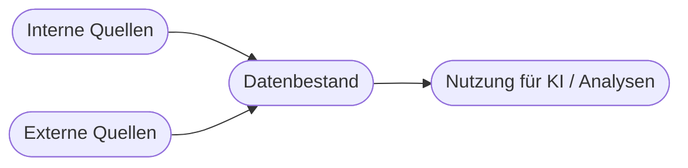

# Kapitel 9 – Datenbeschaffung

{{ progress(9) }}

<div class="lernziele" markdown>
<h3>Was du in diesem Kapitel lernst</h3>

- Warum **Daten der Rohstoff** jeder KI sind und welche **Arten** es gibt
- Welche **Datenquellen** Unternehmen zur Verfügung stehen (intern und extern)
- Was **strukturierte, semistrukturierte und unstrukturierte** Daten unterscheidet
- Welche **rechtlichen und ethischen** Grenzen die Datenbeschaffung hat
- Wie **Copilot** auf deine Daten zugreift – und wo die Grenzen liegen
</div>

---

## 9.1 Daten – der Rohstoff der KI

KI lernt aus Daten. Ohne passende Daten gibt es kein sinnvolles Modell – und selbst ein fertiges Werkzeug wie Copilot liefert nur dann gute unternehmensspezifische Antworten, wenn es auf **gute Daten** zugreifen kann.

!!! info "Menge UND Qualität"
    Ein verbreiteter Irrtum: „Viele Daten = gute KI". Richtig ist: Es braucht **genug** Daten **und** die **richtige Qualität**. 10.000 saubere, korrekt beschriftete Beispiele sind mehr wert als 1 Million widersprüchliche. Mehr dazu in Kapitel 10.

---

## 9.2 Datenarten: strukturiert, semistrukturiert, unstrukturiert

| Art | Merkmal | Beispiel | Maschinell nutzbar? |
|---|---|---|---|
| **Strukturiert** | feste Tabellenform, klare Felder | Datenbank, Excel, ERP | sehr gut |
| **Semistrukturiert** | teils geordnet, mit Markierungen | JSON, XML, E-Mails mit Feldern | gut |
| **Unstrukturiert** | keine feste Form | Fließtext, Bilder, Audio, PDFs | schwieriger, aber wertvoll |

!!! tip "Warum das wichtig ist"
    Der **größte Teil** der Unternehmensdaten ist **unstrukturiert** – E-Mails, Verträge, Protokolle, Präsentationen. Genau hier glänzt generative KI: Sprachmodelle wie hinter **Copilot** können unstrukturierten Text lesen, zusammenfassen und durchsuchbar machen, wofür früher aufwendige Spezialsysteme nötig waren.

---

## 9.3 Datenquellen im Unternehmen



**Interne Quellen:**

| Quelle | Beispiel-Inhalte |
|---|---|
| ERP-/CRM-Systeme | Aufträge, Kunden, Rechnungen |
| E-Mail & Dokumente | Korrespondenz, Verträge, Berichte |
| Maschinen/Sensoren | Messwerte, Laufzeiten (IoT) |
| Web-/Shop-Systeme | Klicks, Käufe, Verweildauer |

**Externe Quellen:**

| Quelle | Beispiel |
|---|---|
| Öffentliche Daten | Wetter, Statistik, Geodaten |
| Eingekaufte Daten | Markt-/Branchendaten |
| Web-Daten | öffentliche Websites (mit Vorsicht!) |

---

## 9.4 Rechtliche und ethische Grenzen

Daten dürfen **nicht einfach beliebig** gesammelt und genutzt werden.

!!! warning "Wichtige Grenzen"
    - **Personenbezogene Daten** unterliegen der **DSGVO** – nur mit Rechtsgrundlage nutzen (Kapitel 33).
    - **Urheberrecht/Lizenzen** beachten – nicht alles, was öffentlich ist, darf man verwenden.
    - **Zweckbindung**: Daten, die für Zweck A erhoben wurden, dürfen nicht ohne Weiteres für Zweck B (KI-Training) genutzt werden.
    - **Betriebsvereinbarungen** und Mitbestimmung beachten, wenn Mitarbeiterdaten betroffen sind.

Diese Grenzen sind kein „Papierkram", sondern echtes Projektrisiko: Ein Datenschutzverstoß kann ein Vorhaben stoppen und teuer werden. Der rechtliche Rahmen wird in **Block 4** vertieft.

---

## 9.5 Wie Copilot auf deine Daten zugreift

**Microsoft 365 Copilot** greift über den **Microsoft Graph** auf die Inhalte zu, auf die **du** ohnehin Zugriff hast: deine Mails, Dokumente, Teams-Chats, Kalender.


!!! info "Das Berechtigungsprinzip"
    Copilot sieht **nur** Daten, für die dein Konto Leserechte hat – es umgeht **keine** Berechtigungen. Fragst du nach einem Dokument, auf das du keinen Zugriff hast, kann Copilot es nicht verwenden. Das ist eine zentrale Sicherheitszusage von Microsoft 365 Copilot.

!!! warning "Datenqualität bleibt entscheidend"
    Copilot ist nur so gut wie die Daten, die es findet. Sind eure Dokumente veraltet, widersprüchlich oder chaotisch abgelegt, liefert auch Copilot schwache oder falsche Bezüge. **Ordnung in den Daten** ist damit direkte Voraussetzung für gute Ergebnisse.

**Copilot-Prompt zum Ausprobieren:**

```text
Fasse die wichtigsten Punkte aus meinen E-Mails der letzten Woche zum Projekt
[Projektname] zusammen und liste offene Aufgaben mit Verantwortlichen auf.
```

---

## Zusammenfassung

- Daten sind der **Rohstoff** der KI – Menge **und** Qualität zählen.
- Man unterscheidet **strukturierte, semistrukturierte und unstrukturierte** Daten; der Großteil im Unternehmen ist unstrukturiert.
- Datenquellen gibt es intern (ERP, Mails, Sensoren) und extern (öffentliche, gekaufte, Web-Daten).
- **Rechtliche/ethische Grenzen** (DSGVO, Urheberrecht, Zweckbindung) sind Pflicht, kein Beiwerk.
- **Copilot** nutzt via Microsoft Graph nur Daten, für die du **berechtigt** bist – Ordnung in den Daten ist entscheidend.

---

## Kurzübungen

{{ task(file="tasks/k09_01.yaml") }}

{{ task(file="tasks/k09_02.yaml") }}

---

## Workshop

{{ task(file="tasks/workshop_k09.yaml") }}
